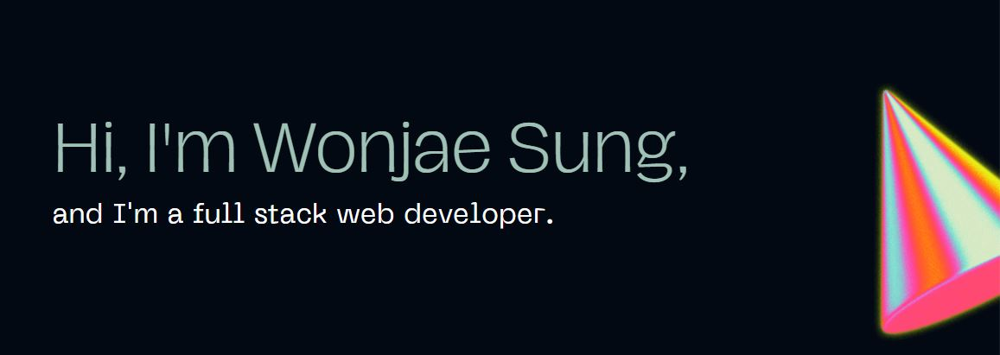

Hello! I'm Wonjae! I'm a full-stack software engineer and accountant, interested in merging my skills to ignite a spark in the tech space! I am currently open to any new freelance clients or full-time opportunities. Please feel free to contact me via email or LinkedIn.

- 🌱 I’m currently learning Express and MongoDB!

- 📫 How to reach me: wsung88@gmail.com

- 🎯 I’m focusing on creating responsive web design

- ⚡ Fun fact: I love to play golf and rock climb

<!--

-->

<h3 align="left">Languages and Tools:</h3>

  <a href="https://developer.mozilla.org/en-US/docs/Web/JavaScript" target="_blank" rel="noreferrer"> 
    </a>  <a href="https://www.mongodb.com/" target="_blank" rel="noreferrer">    </a>    

<!--
**WonjaeSung/WonjaeSung** is a ✨ _special_ ✨ repository because its `README.md` (this file) appears on your GitHub profile.

Here are some ideas to get you started:

- 🔭 I’m currently working on ...
- 🌱 I’m currently learning ...
- 👯 I’m looking to collaborate on ...
- 🤔 I’m looking for help with ...
- 💬 Ask me about ...
- 📫 How to reach me: ...
- 😄 Pronouns: ...
- ⚡ Fun fact: ...
-->
